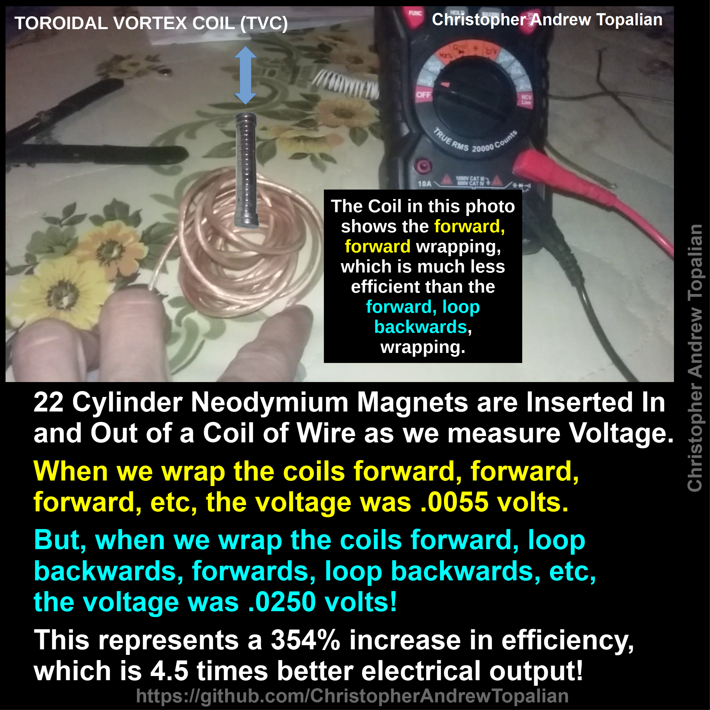

// toroidal_vortex_coil_007.md

### Caption: The Coil in this photo shows the forward, forward wrapping, which is much less efficient than the forward, loop backwards, wrapping.

---

## 22 Cylinder Neodymium Magnets are Inserted In and Out of a Coil of Wire as we measure Voltage.

## When we wrap the coils forward, forward, forward, etc, the voltage was .0055 volts.

## But, when we wrap the coils forward, loop backwards, forwards, loop backwards, etc, the voltage was .0250 volts!

## This represents a 354% increase in efficiency, which is 4.5 times better electrical output!

//----//

// Dedicated to God the Father  
// All Rights Reserved Christopher Andrew Topalian Copyright 2000-2026  
// https://github.com/ChristopherTopalian  
// https://github.com/ChristopherAndrewTopalian  
// https://sites.google.com/view/CollegeOfScripting

